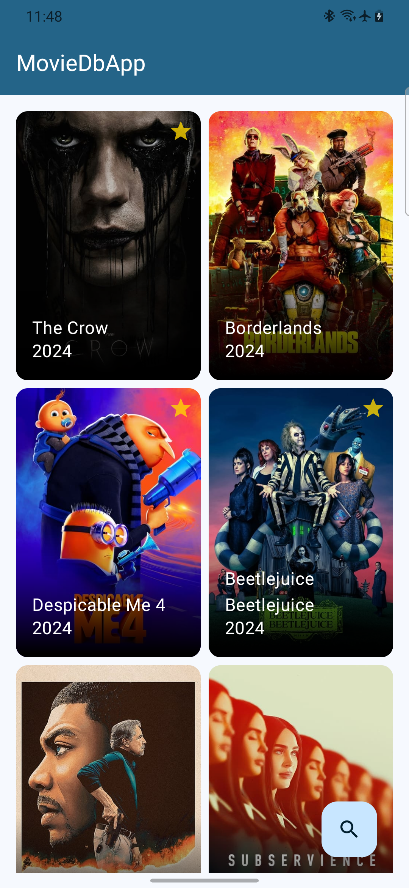
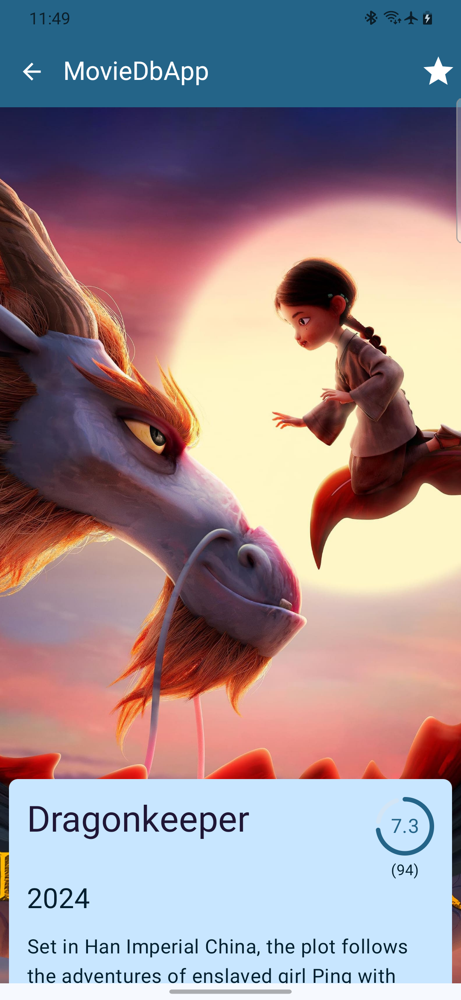
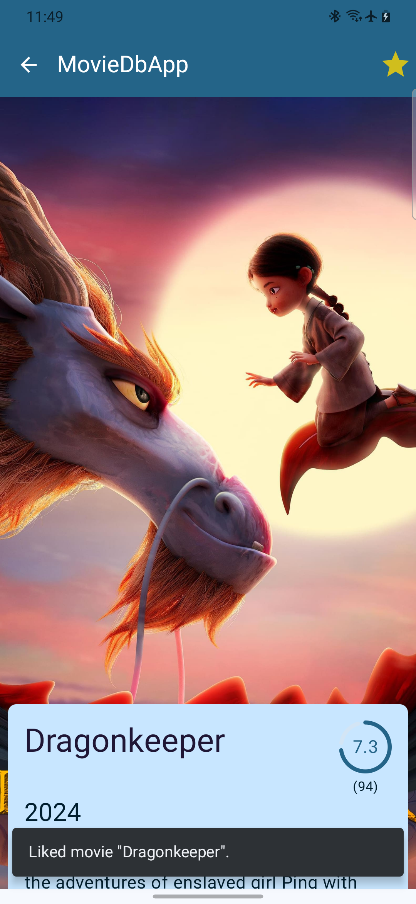
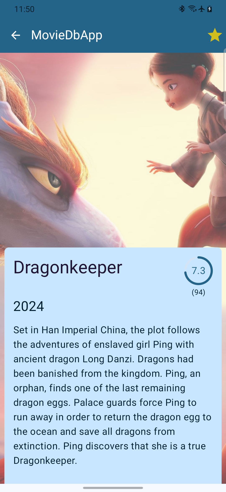
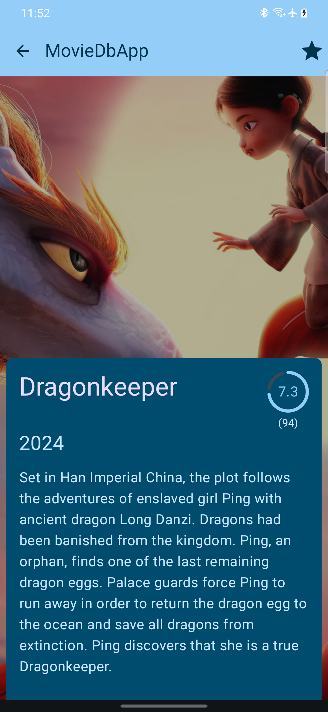
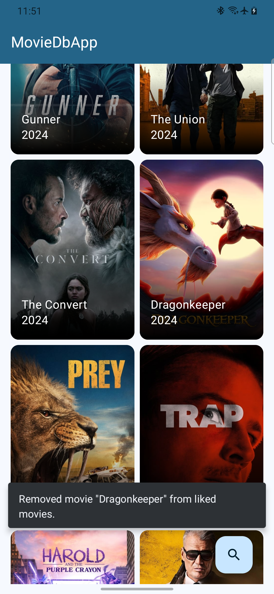
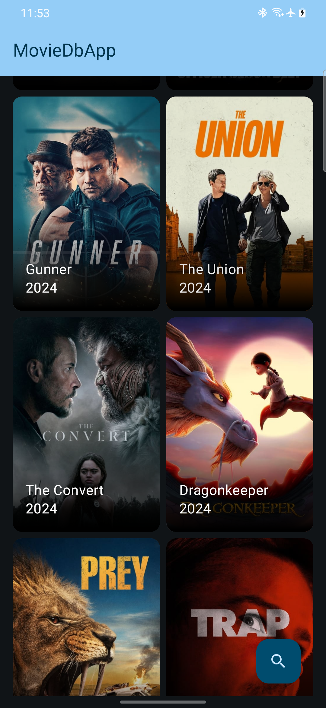
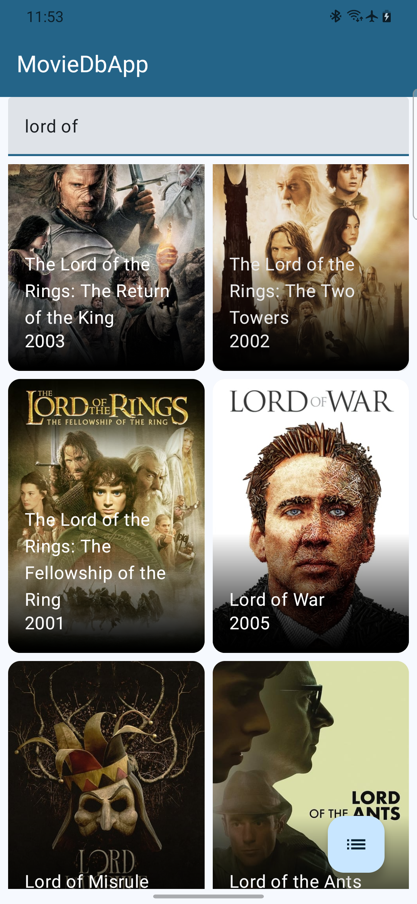
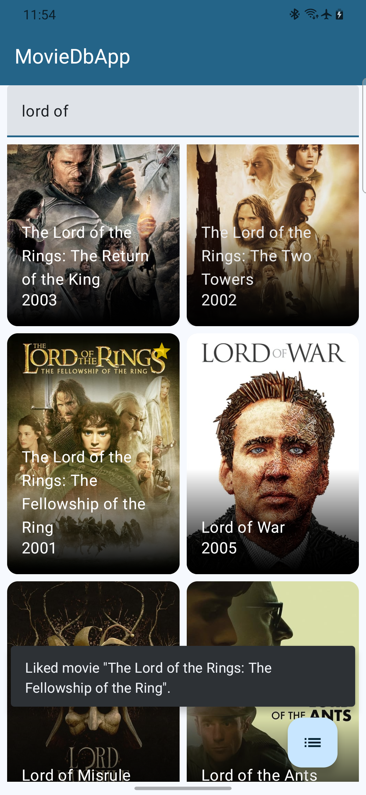
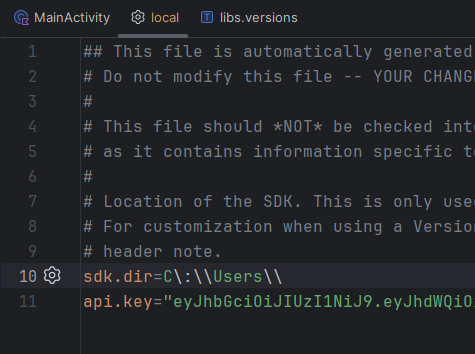

# The Movie Db Android application

## Project description
The application consists of 2 screens:
- Movie list
- Details about the selected film

After launching the application, a screen with a list of films currently playing in cinemas is presented. List is sorted by movie popularity. When it is displayed, data for the first 3 "pages" is downloaded, and as you scroll down the list, subsequent "pages" are downloaded. After long-pres on the movie tile you can add it to the favourites, and after short-click you wil be navigated to data about clicked movie.
On that screen star iconon is on the app bar, clicking on which adds the movie to favorites. This is additionally confirmed by the snackbar. The icon is toggleable, so by clicking it alternately you can add and remove the movie from favorites.  
Additionally, in the lower right corner on first screen there is a Floating action button that changes the list of popular movies to a list of movies found using the entered phrase. This list is also paginated, and it's possible to like movies and view their details. The video search process is triggered automatically - by default 500ms after typing stopped. This time can be configured in the file [ConfigConstants](./core/src/main/java/com/klewerro/moviedbapp/core/util/ConfigConstants.kt), and moreover:
- Set http request delay (useful for testing pagination)
- Prefetch distance
- Page size (better to not change this 😉)

## Screenshots
||||
|---|---|---|
||||
||||

## Project structure
The project follows a multi-module architecture. Modules are context based, and packages inside them are type based. The proroject contains following modules:
- **App** - Android app module. Mainy holds DI module, Activity with MainScreen and navigation setup.
- **Core** - inherited by all other modules. Contains common functionalities used across the app, eg. DataSources (remote and local), Repository, mappers, resources, util classes.
- **Movies** and **MovieDetails** - feature modules containing mainly Screens and it's composables.

## Project setup
To run the project, you need to provide the API key for *The Movie Db* in file local.properties (./local.properties). Instructions on how to get it can be found [here](https://developer.themoviedb.org/docs/getting-started).
You can also just install .apk, which can be found in release section in this repository.

## Libraries and technologies used:
- General
    - Kotlin
    - Coroutines
    - Flow
    - Android SDK
    - Dagger Hilt
    - Timber, Ktlint, Ksp
- UI
    - Jetpack compose
    - Navigation component
    - Material 3
    - Coil
    - Paging 3
- Data
    - Retrofit
    - Room
- Test
    - Junit
    - AssertK
    - Mockk
    - Turbine
    - Coroutines-test

## Task description
The application was created in the form of a coding challenge, with the following requirements:
- Use The Movie DB API.
- Display collection of movies currently playing in theaters (use the */movie/now_playing* endpoint).
- ***Nice to have*** Include pagination.
- Create a details screen with a movie poster (backdrop path or poster path), title, release date, rating and a short description (overview). Data can be passed to this view or an additional call can be made for movie details.
- ***Nice to have*** The list screen can also implement autocomplete search. Use the */search/movie* endpoint here.
- We should be able to mark a movie as a favorite (adding a star to the *list/tile* and e.g. on the Toolbar on the details screen). The star will be enabled if the movie is a favorite. The status of liking a movie should be saved and presented after restarting the application.
- Application must be written in Kotlin, the application should run on an emulator and any selected Android phone model with miDsk 26+. The task should take no longer than 3 days.